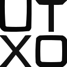
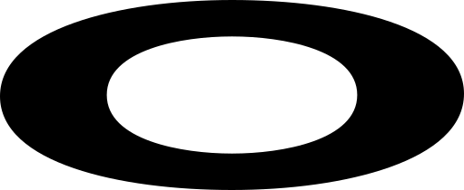
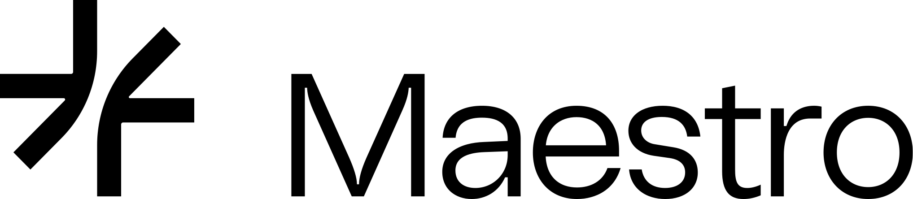
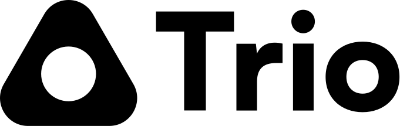
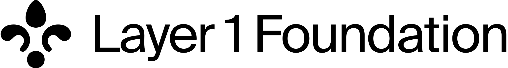
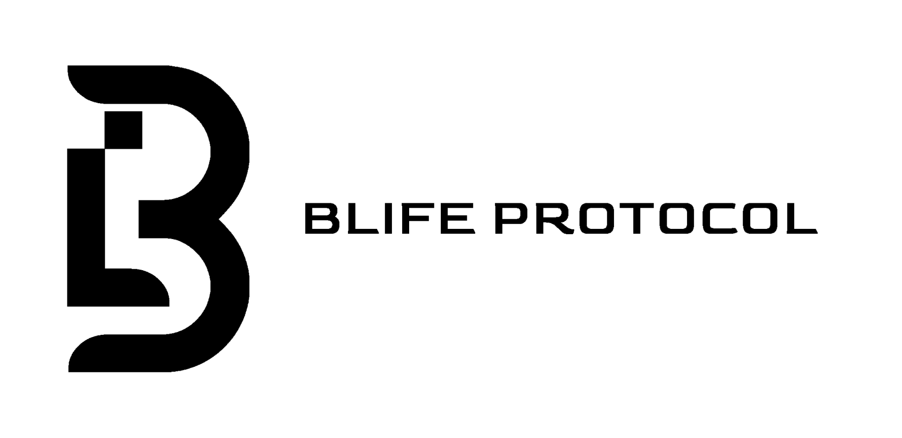
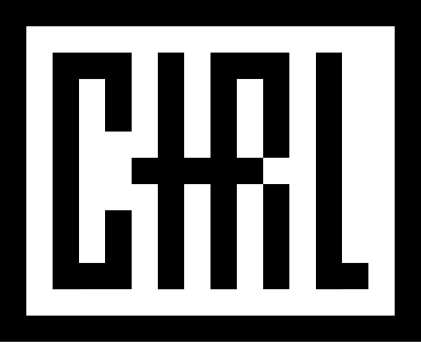
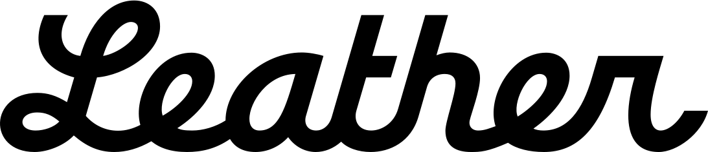

# LaserEyes

Wallet connect library making it easier than ever to quickly build/maintain Bitcoin Oridnal Web Apps.

## Documentation

For documentation and guides, visit [Laser Eyes Docs](https://lasereyes.build/).

## Demo

Don't trust verify [Try Out The Demo Here](https://demo.lasereyes.build)

## Wallets Supported:

- Leather
- Magic Eden
- OKX
- Orange Wallet
- OYL
- Unisat
- Wizz
- Phantom
- Xverse

## Why Laser Eyes?

## Community

For help, discussion about best practices, or any other conversation that would benefit from being searchable:

[Discuss Laser Eyes on GitHub](https://github.com/omnisat/lasereyes/discussions)

## Contributing

Contributions to Laser Eyes are greatly appreciated! If you're interested in contributing to this open source project, please read the [Contributing Guide](https://www.lasereyes.build/docs/contributing) **before submitting a pull request**.

## Sponsors

If you find Laser Eyes useful or use it for work, please consider [sponsoring Laser Eyes](https://github.com/sponsors/omnisat). Thank you 🙏

<h2 style="text-align: center;">Ecosystem Partnerships</h2>

  <a href="https://www.utxo.management/">
    <picture>
      <source media="(prefers-color-scheme: dark)" srcset="./.github/assets/utxo-light.svg">
      <source media="(prefers-color-scheme: light)" srcset="./.github/assets/utxo-dark.svg">
      
    </picture>
  </a>
  <a href="https://www.oyl.io/">
    <picture>
      <source media="(prefers-color-scheme: dark)" srcset="./.github/assets/oyl-light.svg">
      <source media="(prefers-color-scheme: light)" srcset="./.github/assets/oyl-dark.svg">
      
    </picture>
  </a>
  <a href="https://www.gomaestro.org/">
    <picture>
      <source media="(prefers-color-scheme: dark)" srcset="./.github/assets/maestro-light.svg">
      <source media="(prefers-color-scheme: light)" srcset="./.github/assets/maestro-dark.svg">
      
    </picture>
  </a>
  <a href="https://www.trio.xyz">
    <picture>
      <source media="(prefers-color-scheme: dark)" srcset="./.github/assets/trio-light.svg">
      <source media="(prefers-color-scheme: light)" srcset="./.github/assets/trio-dark.svg">
      
    </picture>
  </a>

  <a href="https://l1f.io/">
    <picture>
      <source media="(prefers-color-scheme: dark)" srcset="./.github/assets/l1f-light.svg">
      <source media="(prefers-color-scheme: light)" srcset="./.github/assets/l1f_dark.svg">
      
    </picture>
  </a>
  <a href="https://x.com/BLIFEProtocol">
    <picture>
      <source media="(prefers-color-scheme: dark)" srcset="./.github/assets/blife-light.svg">
      <source media="(prefers-color-scheme: light)" srcset="./.github/assets/blife-dark.svg">
      
    </picture>
  </a>

<h2 style="text-align: center;">Start-Up Sponsors</h2>

  <a href="https://www.seizectrl.io/">
    <picture>
      <source media="(prefers-color-scheme: dark)" srcset="./.github/assets/ctrl.svg">
      <source media="(prefers-color-scheme: light)" srcset="./.github/assets/ctrl-dark.svg">
      
    </picture>
  </a>
  <a href="https://leather.io/">
    <picture>
      <source media="(prefers-color-scheme: dark)" srcset="./.github/assets/leather-light.svg">
      <source media="(prefers-color-scheme: light)" srcset="./.github/assets/leather-dark.svg">
      
    </picture>
  </a>

 

<h4 style="text-align: center; font-size: 1.5em; margin-top: 20px; margin-bottom: 20px;">
  <a href="https://github.com/sponsors/omnisat">Become A Sponsor</a>
</h4>
